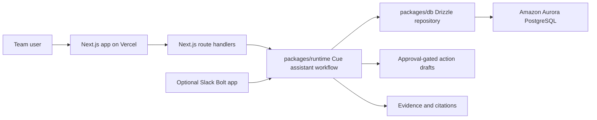

# Architecture

Cue for Teams is a focused hackathon slice of Cue: a workplace command center that answers launch and execution questions with saved chats, team memory, citations, and approval-gated actions.

## System Path

## Apps

- `apps/web`: Vercel-deployable Next.js app. It owns the Home and Chats surfaces.
- `apps/slack`: optional Slack Bolt surface. It is intentionally thin and calls the same shared runtime as the web app.

## Packages

- `packages/types`: shared data contracts for chats, citations, approvals, launch readiness, and home feed content.
- `packages/db`: Drizzle schema, Aurora-compatible Postgres repository, migration SQL, and seed data.
- `packages/runtime`: simplified Cue assistant workflow. The H0 launch-readiness path gathers context from the repository, evaluates blockers and evidence gaps, and drafts approval-gated actions.

## Database

Aurora PostgreSQL is the production target. The schema uses portable Postgres tables and JSONB where useful:

- `chat_threads`, `chat_messages` for persistent ChatGPT-like conversations.
- `memory_records` for remembered decisions.
- `citations` for grounded evidence cards.
- `tasks`, `tickets`, `meetings` for workplace context.
- `launches`, `launch_checks` for readiness state.
- `approvals`, `workflow_runs` for action gating and workflow traceability.
- `connector_accounts`, `activity_events` for connected-source state and the Home feed.

The app does not depend on Supabase-only APIs. Local development can use any standard Postgres connection string; production can use an Aurora PostgreSQL connection string.

## Runtime Flow

1. Home bootstrap loads the workspace, connectors, Today items, For you feed, recent activity, approvals, and chat history.
2. A homepage search posts to `/api/chats`.
3. The route handler calls `generateCueResponse` from `packages/runtime`.
4. For H0/readiness questions, the runtime runs a trimmed launch-readiness workflow:
   - collect launch checks, tasks, tickets, memory, approvals, and citations;
   - classify blockers, risks, and missing evidence;
   - create approval records for suggested writes;
   - return a structured answer with citations and action cards.
5. The route persists the chat thread and messages through the Drizzle repository.
6. Approval cards call `/api/approvals/:approvalId`, which marks the approval approved or rejected without performing destructive writes.

## Deployment Shape

- Vercel hosts `apps/web`.
- Aurora PostgreSQL stores the workspace state.
- Slack can run separately as a Node process if the bot surface is included in the demo.
- Future connector workers can write into the same Postgres tables through the repository boundary.
