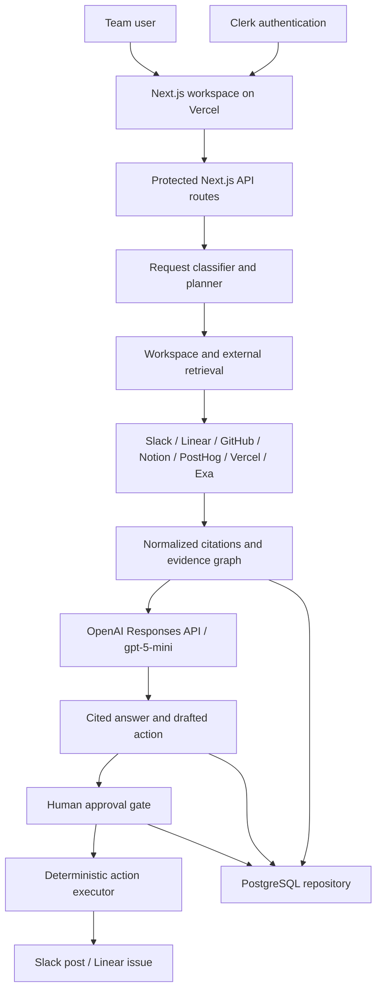

# Architecture

Cue is a work intelligence and execution agent. It plans multi-source investigations, normalizes retrieved evidence, synthesizes cited answers with OpenAI, and keeps side effects behind human approval.

## System Path

## Web Application

`apps/web` contains:

- Public landing page with light and dark themes.
- Clerk sign-in and sign-up routes.
- Protected workspace at `/app`.
- Home feed, chats, planning states, retrieval trace, citations, synthesis, and approvals.
- API routes for bootstrap, chats, follow-up messages, and approval resolution.

## Runtime

`packages/runtime` owns the agent flow:

1. Classify the request.
2. Build task-specific plan steps.
3. Select relevant workspace and external evidence.
4. Normalize results into shared citations.
5. Use OpenAI `gpt-5-mini` to synthesize the decision, evidence trail, owners, impact, and next action.
6. Build Slack or Linear action previews.
7. Wait for explicit approval.
8. Execute the approved action through a deterministic API client.

The live UI mirrors this sequence. Pending retrieval rows contain no findings. Active rows show the current operation, and source details appear only after completion.

## Evidence Model

Each citation contains a source, source record ID, title, excerpt, URL, author, timestamp, freshness state, and workspace ID. Shared identifiers such as `H0-19`, `PR #482`, and `workspaceId` allow Cue to connect records across tools.

Retrieval results are grouped into:

- Workspace evidence
- Release timeline
- External signals

This keeps internal company facts separate from public web context.

## Data Layer

`packages/db` provides a repository interface with PostgreSQL and in-memory implementations. PostgreSQL access uses Drizzle ORM and `postgres.js`.

Core tables:

- `workspaces`
- `connector_accounts`
- `citations`
- `tickets`
- `tasks`
- `memory_records`
- `launches`
- `launch_checks`
- `activity_events`
- `chat_threads`
- `chat_messages`
- `workflow_runs`
- `approvals`

Structured plans, retrieval traces, citations, and model output are stored with chat messages. Workflow and approval records preserve action history.

## Approval Boundary

The model drafts actions but never executes them directly.

1. Runtime produces an exact preview.
2. UI opens an approval dialog.
3. User approves or discards.
4. API resolves the approval record.
5. Deterministic executor calls Slack or Linear.
6. UI reports the execution result.

## Deployment

- Vercel hosts the Next.js application.
- Clerk provides authentication.
- OpenAI provides planning-aware synthesis.
- Exa provides external web context.
- PostgreSQL stores workspace and workflow state when `DATABASE_URL` is configured.
- Slack and Linear receive approved actions.

Local development can run without PostgreSQL through the in-memory repository.
